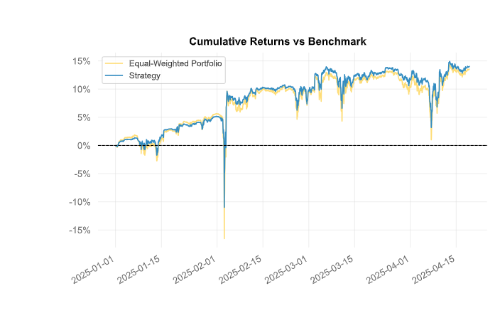

# Grid Strategy Portfolio Optimization

This project implements a systematic approach to optimize cryptocurrency grid trading strategies using risk-based portfolio allocation. The system consists of two main components:

## 1. Ulcer Index Calculation (`calculate_ulcer_index.py`)

The Ulcer Index is a volatility metric that measures the depth and duration of drawdowns in price series.
The index is based on a given past period of N days. Working from oldest to newest a highest price (highest closing price) seen so far is maintained, and any close below that is a retracement, expressed as a percentage:

$ Ri = \frac{100 * (price_i - max price)}{max price} $

Where price_i is the closing price on day i, max price is the highest closing price seen so far.

$ UlcerIndex = \sqrt{\frac{R_1^2 + R_2^2 + ... R_N^2}{N}} $

Because the R values are squared it is immaterial whether they are expressed as positives or negatives; both result in a positive Ulcer Index.

This script:

- Processes historical price data for multiple cryptocurrencies
- Calculates the Ulcer Index using a rolling window (default 30 days)
- Scales the index values to a range of 2-10 (where 10 represents the lowest risk)
- Normalizes the scores so they sum to 100 for portfolio allocation

### Key Features:
- Aggregates hourly price data to daily candles using min value of the day
- Handles missing data and edge cases
- Provides both raw and scaled risk metrics
- Outputs allocation weights that sum to 100%

## 2. Portfolio Optimization (`portfolio_optimization.py`)

This module implements portfolio optimization with a focus on risk management:

### Data Processing Pipeline:
1. **Data Loading**:
   - Loads grid strategy performance data from CSV files
   - Handles both backtested and real trading data

2. **Data Preparation**:
   - Resamples data to consistent timeframe 1H
   - Calculates period-to-period returns from PnL values

3. **Optimization Approach**:
   - Implements Worst Realization (WR) optimization
   Calculate the Worst Realization (WR) or Worst Scenario of a returns series.

   $ \text{WR}(X) = \max(-X) $ 
   - Supports constraints on minimum = 0.01/maximum = 0.15 weights per strategy
   - Prevents over-concentration in single strategies


## Final weights calculation
Having received weights from the approach with optimization and having received weights from the approach with Ulzer index we calculate the final weight by the formula:

$ FinalWeight = 0.75*UlcerIndexWeight + 0.25*OptimizationWeight $

## Usage

1. First, run `calculate_ulcer_index.py` to generate risk scores:
   ```bash
   python grid_strategy_optimization_main/calculate_ulcer_index.py
   ```

2. Then, run the portfolio optimization:
   ```bash
   python portfolio_optimization.py
   ```

## Outputs

- Ulcer Index scores and scaled weights for each cryptocurrency
- Optimized portfolio weights
- Performance visualizations and metrics

## Dependencies

- Python 3.7+
- pandas
- numpy
- matplotlib
- plotly
- cvxpy (for optimization)

## Practical Case

### **1. Backtest Data Adjustment**
   - Initially grid strategy is data for each strategy on real trades and on backtest. In order to objectivize the backtest data, it is necessary to correct them to get the data closer to real trades. If the data has different timeframes, they are all summarized to the smallest common multiple of the timeframe.
   - For grid strategies, the adjustment is made for three parameters : positive returns, negative returns and volatility. Accordingly, these parameters are calculated for real trading data and applied to backtest data. To get the time series from adjusted backtest + real trades as a result.
   - It is important to note that the figures are averaged across all strategies and are the same for all grid strategies.
   
   I give examples of coefficients for adjustment on the tested set of 31 strategies.

   There is an important principle when adjusting, a strategy cannot become better in the parameters after applying the coefficients. If such a case occurs, we do not apply coefficients. 

   Backtest data adjustment for type: grid
   Adjustment for grid type:
   - Volatility ratio: 1.8526
   - Negative volatility ratio: 2.3876
   - Positive change ratio: 2.4238 (not applicable because it overestimates the backtest)

### **2. Basic Logic**
   - Calculation of weights for strategies using the Ulcer indicator
   - Calculating weights for strategies using convex optimization by Worst Realization function.
   - Normalizing the weights so that the total weight is equal to 100%
   - Calculating the final weight using both approaches in the proportion of 1 to 3
   $ FinalWeight = 0.75*UlcerIndexWeight + 0.25*OptimizationWeight $

### **3. improvement**
The advantage of our approach over uniformly distributed weights is shown in the figure below.

Was -> Became

Cumulative Return	13.54% -> 14.03% 

CAGR﹪	34.87% -> 36.24%

Max Drawdown	-21.0% -> -15.36%


Volatility (ann.)	40.6% -> 31.74%

Calmar	1.66 -> 2.36

Daily Value-at-Risk	-0.71% -> -0.55%

Expected Shortfall (cVaR)	-0.71% -> -0.55%


