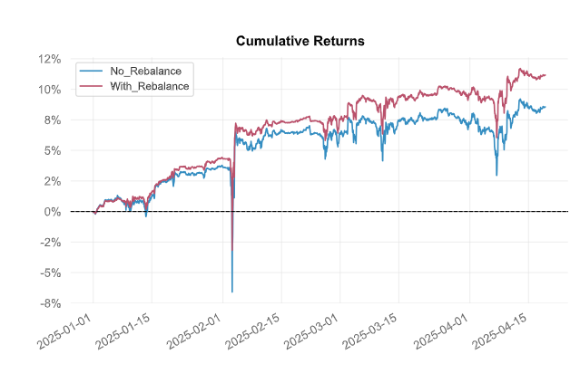

# Подход к оптимизации стратегий

## Обзор

Этот документ описывает методологию оптимизации портфеля, объединяющего трендовую и грид-стратегии. Основная цель - найти оптимальное соотношение между этими стратегиями, максимизируя доходность при контролируемом уровне риска.

## Ключевые метрики

### Базовые метрики

1. **Годовая доходность (%)**
   - Общая годовая доходность стратегии

2. **Волатильность (%)**
   - Годовая стандартное отклонение доходности

3. **Максимальная просадка (%)**
   - Наибольший наблюдаемый пик-к-пиковый спад портфеля

### Коэффициенты эффективности

1. **Коэффициент Шарпа**
   - Отношение избыточной доходности к волатильности
   - `Sharpe = (Return - RiskFree) / Volatility`

2. **Коэффициент Сортино**
   - Аналогичен Шарпу, но учитывает только волатильность убыточных периодов

3. **Коэффициент Калмара**
   - Отношение годовой доходности к максимальной просадке
   - `Calmar = Annual Return / |Max Drawdown|`

4. **Ulcer Performance Index**
   - Модифицированный коэффициент Шарпа с Ulcer Index в знаменателе
   - `UPI = Annual Return / Ulcer Index`

### Показатели риска

1. **Value at Risk (5%)**
   - Ожидаемый максимальный убыток с доверительным интервалом 95%

2. **CVaR (5%)**
   - Условная стоимость под риском (средний убыток в худших 5% сценариев)

3. **Ulcer Index**
   - Индекс язвы, измеряющий глубину и продолжительность просадок
   - Рассчитывается как корень из среднего квадратов просадок от пика

## Метод оптимизации

### Шаги алгоритма

1. Генерация набора весов от 0% до 100% для грид-стратегии (соответственно, от 100% до 0% для трендовой)
2. Для каждого набора весов:
   - Расчет взвешенной доходности портфеля
   - Расчет всех метрик эффективности
   - Расчет дельт по сравнению с предыдущим весом

### Анализ чувствительности

Для каждой метрики рассчитывается дельта - изменение значения при переходе к следующему весу. Это позволяет оценить:
- Насколько сильно меняется эффективность при изменении весов
- В каких диапазонах весов наблюдается наибольшая чувствительность
- Где находятся точки перегиба в эффективности

## Интерпретация результатов

### Ключевые соотношения

1. **Sharpe/CVaR Delta Ratio**
   - Показывает, насколько эффективно увеличивается коэффициент Шарпа при изменении CVaR
   - Высокое значение указывает на эффективное управление риском

2. **Calmar/Drawdown Delta Ratio**
   - Оценивает, насколько эффективно увеличивается коэффициент Калмара при изменении просадки

### Принятие решений

1. **Выбор оптимального веса**
   - Анализ кривой эффективности по всем метрикам
   - Поиск точки, где дальнейшее увеличение риска не дает пропорционального прироста доходности

2. **Оценка устойчивости**
   - Анализ стабильности метрик в окрестности точки оптимума
   - Предпочтение весовым комбинациям с плавным изменением метрик

## Ключевой результат по улучшению стратегий с весом 50/50

На графике без рабалансировке указано равномерное распределение весов для трендовых + сеточнгых стратегий, а с ребалансировкой указаны трендовые и сеточные стратегии с оптимальными весами.

Cumulative Return	8.56% -> 11.16%

CAGR﹪	21.12% -> 28.0%

Max Drawdown	-10.0% -> -7.28%

Volatility (ann.)	3.2% -> 2.53%

Calmar	2.11 -> 3.84

Daily Value-at-Risk	-0.33% -> -0.26%

Expected Shortfall (cVaR)	-0.33% -> -0.26%

