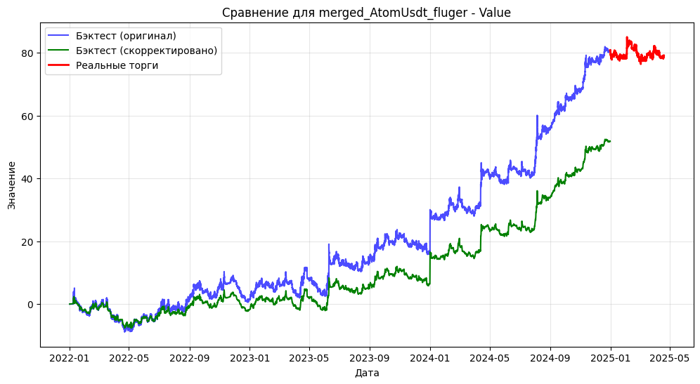
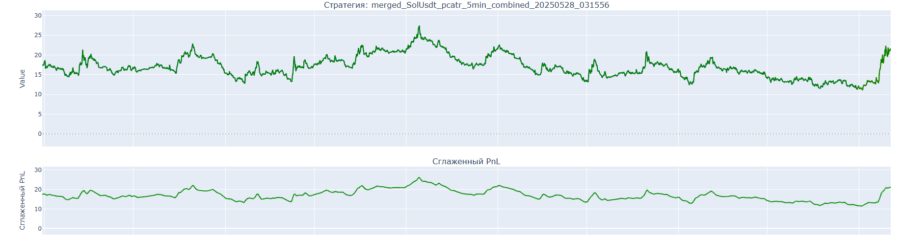
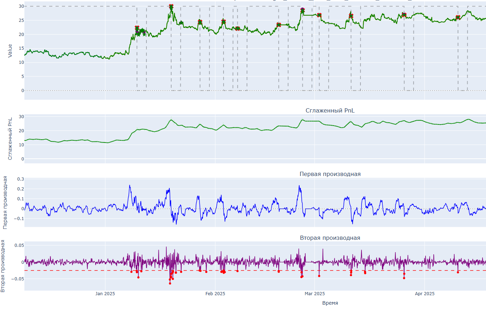

# Trend Strategy Optimization Algorithm

## Algorithm Overview

This project implements a sophisticated algorithm for detecting optimal trading points in cryptocurrency trend strategies. The core algorithm analyzes performance data to identify peaks and potential rebalancing points using signal processing techniques.

## How It Works

1. **Data Preparation**:
   - The algorithm processes CSV files containing strategy performance data
   - Resamples data to hourly timeframes, taking the maximum value for each hour
   - Creates a combined series from backtest and real trading data when available

2. **Signal Processing**:
   - Applies Savitzky-Golay filter to smooth the performance curve (PnL) - filter helps remove noise in the data and smooth out sharp values by approximating the neighborhood of each measurement with a step polynomial.
   
   

   - Calculates first derivative (rate of change) and second derivative (acceleration/deceleration)
   - Establishes a quantile threshold (1% quantile) for significant negative second derivative values

3. **Peak Detection**:
   - Identifies peaks where:
     - First derivative changes from positive to negative (trend reversal point)
     - Second derivative was below the global quantile threshold in the previous 24 hours
   - Marks these points as potential rebalancing signals

4. **Weight Management**:
   - Implements a weight system (1 = active, 0 = inactive) for strategy allocation
   - After a rebalance signal, applies a cooldown period (64 hours) where weight is set to 0
   - Includes a recovery period (24 hours) after cooldown where no new peaks are checked
   - Specific cooldawn values were taken as an example and averaged out. The final approach should not include an unweighted period as a constant, it is important to look at the work of the trend analysts themselves.

5. **Output**:
   - Saves processed data with additional columns for smoothed values, derivatives, detected peaks, and weights
   - Generates CSV files with "_joined_with_peak" suffix for further analysis and visualization

## Technical Details

- Uses `scipy.signal.find_peaks` and `scipy.signal.savgol_filter` for signal processing
- Window length for Savitzky-Golay filter: 25 (odd number)
- Polynomial order for filter: 1
- Quantile level for significant changes: 0.01 (1%)
- Lookback period for second derivative analysis: 24 hours
- Default cooldown after rebalance: 64 hours
- Recovery period: 24 hours

## Practical Case

### **1. Backtest Data Adjustment**
   - Initially there is data for each strategy on real trades and on backtest. In order to objectivize the backtest data, it is necessary to correct them to get the data closer to real trades. If the data has different timeframes, they are all summarized to the smallest common multiple of the timeframe.
   - For trend strategies, the adjustment is made for three parameters : positive returns, negative returns and volatility. Accordingly, these parameters are calculated for real trading data and applied to backtest data. To get the time series from adjusted backtest + real trades as a result.
   - It is important to note that the figures are averaged across all strategies and are the same for all trend-followers.
   
   I give examples of coefficients for adjustment on the tested set of 28 strategies.

   Adjustment for trend type:
   
   - Volatility ratio: 0.7649
   - Negative change ratio: 1.0488
   - Positive change ratio: 1.0108

   

### **2. Data Preparation**
   - After the corrected data is loaded, the data is resampled to hourly timeframes, taking the maximum value for each hour.
   - Applies Savitzky-Golay filter to smooth the performance curve (PnL) - filter helps remove noise in the data and smooth out sharp values by approximating the neighborhood of each measurement with a step polynomial. Soft parameters are used for smoothing, in the form of a window of 25 values and a unit polynomial.

   

### **3. Signal Processing & Peak Detection**

   - Calculates first derivative (rate of change) and second derivative (acceleration/deceleration)
   - Establishes a quantile threshold (1% quantile) for significant negative second derivative values. For each strategy quantile is calculated individually. This parameter should be adjusted if we want to get more signals or vice versa.
   - Identifies peaks where:
     - First derivative changes from positive to negative (trend reversal point)
     - Second derivative was below the global quantile threshold in the previous 24 hours. The time margin is needed for cases when the signal from the second derivative comes somewhat faster than from the first derivative
   - Marks these points as potential rebalancing signals. In reality, the rebalance signal arrives 1 hour later than where it was recorded. This is due to the approach in checking the nearest values
   

### **4. Weight Management**
   - Implements a weight system (1 = active, 0 = inactive) for strategy allocation
   - After a rebalance signal, applies a cooldown period (64 hours) where weight is set to 0
   - Includes a recovery period (24 hours) after cooldown where no new peaks are checked
   - Specific cooldawn values were taken as an example and averaged out. The final approach should not include an unweighted period as a constant, it is important to look at the work of the trend analysts themselves.
   

